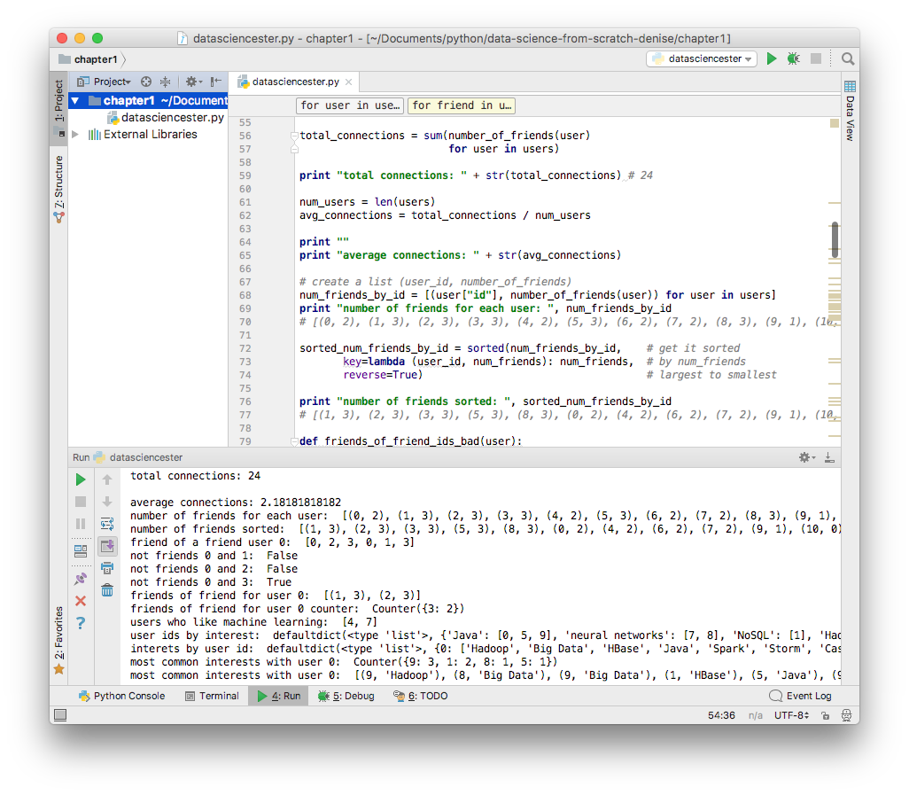

# Tag 1 - Vorbereitungsarbeiten und erste Programmierversuche

## Samstag, 14. Mai 2017
Gestern Abend habe ich das [Data Science from Scratch](http://amzn.to/2qFunSd) Buch aus der Packstation geholt und heute Abend fange ich es endlich an zu lesen. Meine Python Version ist 2.7, diese wird auch im Buch empfohlen. Weiters muss ich mir [Anaconda](https://www.continuum.io/downloads) installieren, da dies schon alle möglichen Data Science Pakete enthält. Als IDE für meine ersten Gehversuche habe ich mich für die Community Edition von [PyCharm](https://www.jetbrains.com/pycharm/) entschieden.

Eigentlich sollte man in diesem Kapitel noch gar nichts programmieren oder installieren, sondern sich nur den Syntax von Python ansehen, aber ich bin da eher so ein Macher-Typ: ausprobieren! Gottseidank liefen alle Installationen problemlos und die Code-Beispiele sind auch recht kurz.

### Kapitel 1 - Einführung
Was ist denn **Data Science** überhaupt? Bei Data Science geht es darum Erkenntnisse aus Daten zu gewinnen. Diese Daten sind of unvollständig oder durcheinander gewürfelt. Man muss viel Vorarbeit in das Aufbereiten der Daten stecken. Wenn man bei einer Datingplatform Fragen beantwortet um den perfekten Partner zu finden, dann ist da Data Science im Spiel 😘 . Ein **Data Scientist** ist jemand der sich mit solchen Themen - also Data Science 😉 - beschäftigt.

Bei dem Beispiel im ersten Kapitel geht es um ein soziales Netzwerk von Data Scientist und man sieht einige, kleine Source-Code-Beispiele um sich einen Überblick über Python zu verschaffen. Bei den Beispielen sieht man sich folgende Dinge an: wer ist mit wem befreundet, wer ist Freund-eines-Freundes, wer hat die gleichen Interessen, wer verdient mit welcher Berufserfahrung wieivel oder wer bezahlt für seinen Account.

Den [Source-Code zum Data Science Buch](https://github.com/joelgrus/data-science-from-scratch/tree/master) gibt auch online auf Github, Kapitel 1 findet man unter [introduction.py](https://github.com/joelgrus/data-science-from-scratch/blob/master/code/introduction.py).

Für mich als JavaScript Entwickler muss ich mich an die Python Ausdrucksweise gewöhnen. Ein Array ist eine Liste, zu einem Dictonary würde ich Objekt sagen und Tupel gibt es in JavaScript nicht.

```python
# Python 2.7
user_ids_list = [ 0, 1, 2, 3 ] # list
user_dict  = { "id": 0, "name": "Denise" } # dictonary
user_tupel = ( 0, "Denise" ) # tupel
```

Ein bisschen Zeit muss man auch immer einplanen um sich mit einer neuen IDE zurecht zu finden und vor allem: wie debugge ich überhaupt?? Da ich als JavaScript Programmierer eine zeitlang [WebStorm](https://www.jetbrains.com/webstorm/) verwendet habe, habe ich mich auch in [PyCharm](https://www.jetbrains.com/pycharm/) schnell zuerecht gefunden und die Code-Completion funktioniert auch gut.

Nachdem alles eingerichtet war ging es also fleißig ans codieren. Ein bisschen einen Knoten ins Gehirn kriegt man anfangs bei **List Comprehensions** - ja was ist eigentlich ein deutscher Begriff dafür? Damit kann man Listen erzeugen, welche bestimmte Eigenschaften haben. Solche derartige Konstrukte gibt es in JavaScript nicht. Hier ein Beispiel:

```python
# Python 2.7
zahlen = [x for x in range(5)]   # [0, 1, 2, 3, 4]
gerade_zahlen = [x for x in range(5) if x % 2 == 0]   # [0, 2, 4]
quadratzahlen = [x * x for x in zahlen]   # [0, 1, 4, 9, 16]
```



Das erste Kapitel habe ich bis zur Hälfte durchgemacht und ist bis zu diesem Punkt eher als Warm-Up für Python gedacht. Mein Gehirn gewöhnt sich noch an den Syntax, aber vor allem die List Comprehensions sind schon sehr elegant. Mit den Beispiel Daten des imaginären Data Scientists Netzwerk herumzuspielen macht schon Laune, also beispielsweise wer ist ein Freund eines Freundes oder hat die gleichen Interessen.

Hier anbei noch ein ganz kleiner Syntax-Überblick von Python, eher eine kleine Gedankenstütze. Ganz wichtig: WHITESPACE!!! Einrückungen haben eine semantische Bedeutung! Man benutzt keine { } um Code zu *gruppieren*, man benutzt Einrückungen!

```python
# Python 2.7

# Kommentar
""" auch ein Kommentar """

def eine_funktion(mit_parameter):
    print "eine funktion"
    return mit_parameter

ergebnis = eine_funktion(5)
```
