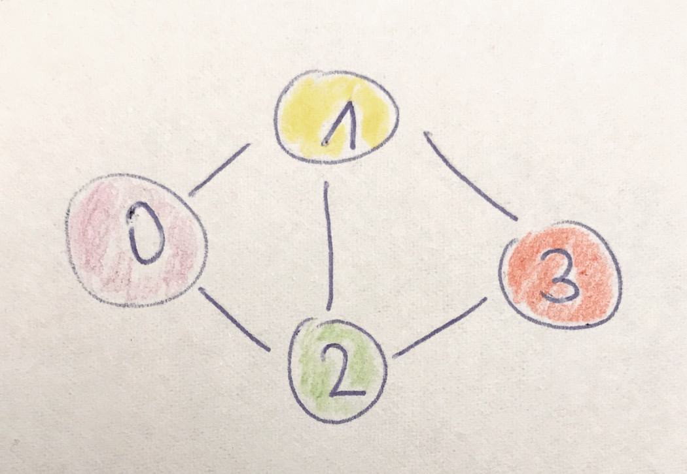

# Tag 2 - Python vs. JavaScript

## Erkenntnisse
Gestern hatte ich bereits erwähnt, dass die **List Comprehensions** in Python etwas gewöhnungsbedürftig aussehen. Als JavaScript Entwickler wollte ich dann natürlich einmal probieren, ob man die Aufgabenstellungen auch in JavaScript lösen kann. Ich wollte möglichst viel von ECMAScript 2015 (oder ES6) verwenden, vor allem aber ⏩ [Arrow Functions](http://exploringjs.com/es6/ch_arrow-functions.html), da diese besonders elegant sind bei z.B. Arrayfunktionen wie ```map```, ```filter``` oder ```reduce```.

```javascript
// JavaScript

var arr = [0, 1, 2, 3, 4, 5];

// Moderene ES6 Notation
var squares = arr.map(x => x * x);

// Bisherige ES5 Notation
var squares = arr.map(function (x) { return x * x });
```

Und natürlich wollte ich auch möglichst viele funktionale Konzepte von JavaScript verwenden, also z.B. statt ```for-Schleifen``` über Arrays dann lieber ```forEach``` beim Arrray verwenden. Beim ganzen Implementieren habe ich auch langsam angefangen Tupel zu vermissen, die gibt es in Swift auch. Entweder nimmt man dann einfach ein Array oder gibt mit einem Objektliteral dem Ganzen doch etwas mehr Bedeutung.

In dem Beispiel sind folgende User miteinander befreundet:
* User 0 mit 1 und 2
* User 1 mit 0, 2 und 3
* User 2 mit 0, 1 und 3
* User 3 mit 1 und 2



Hier also mein Beispiel-Coding in JavaScript:
```javascript
// JavaScript

var users = [
  { "id": 0, "name": "Denise" },
  { "id": 1, "name": "Michelle" },
  { "id": 2, "name": "Martina" },
  { "id": 3, "name": "Andrea" }
];

var friendships = [
  [0, 1], [0, 2],
  [1, 2], [1,3],
  [2, 3]
];

// add a friends property to each user
users.forEach( user => user.friends = [] );

// add the friends to the user and vice-versa
friendships.forEach( friendship => {

  const user = friendship[0];
  const friend = friendship[1];

  // append the friend to the user
  users[user].friends.push(users[friend]);

  // also append the user to the friend
  users[friend].friends.push(users[user]);
});
```

Der User 0 würde dann so aussehen:

```javascript
users[0]
Object {id: 0, name: "Denise", friends: Array(2)}
```

Damit ich jetzt das Freunde-von-Freunden Feature implementieren kann, braucht man ein paar Hilfsfunktionen. Einerseits muss ich wissen, ob zwei User nicht schon miteinander befreundet sind ```notFriends(user, otherUser)``` und andererseits bringt es auch nichts sich selbst zu zählen ```notTheSameUser(user, otherUser)```. Und da ich viel mit map gearbeitet haben, muss ich mein Array am Schluss wieder flachklopfen ```flatten(arr)```, d.h. statt Arrays im Array nur ein Array:
```javascript
// JavaScript

// flatten an array with multiple arrays inside
// [[0, 1], [2], [3, 4]] => [0, 1, 2, 3, 4]
function flatten(arr) {
  return arr.reduce( (acc, val) => acc.concat(
    Array.isArray(val) ? flatten(val) : val
  ),[]);
}
```

Beim gemeinsame-Freunde-von-Freunde Feature iteriert man also über die Freunde eines Freundes, prüft ob man schon befreundet ist und man nicht selbst gemeint ist und merkt sich dann die ID des Freund-eines-Freunds und des Freundes. Hier das JavaScript-Coding mit extra viel Kommentaren:

```javascript
// JavaScript

// get the mutual friends of a friend
// foaf is short for friend of a friend
function friendsOfFriends(user) {

  // iterate over the user's friends
  var result = user.friends.map( friend => {
    // iterate over the friends of a friend
    return friend.friends.filter( foaf => {
        // only valid if the user is not the user itself
        // and the user is not already friends
        return notTheSameUser(user, foaf)
               && notFriends(user, foaf);
    })
    // we interested in the friend ID and the friend of a friend ID
    .map( foaf => {
      return { "friendId": friend.id, "foafId": foaf.id }
    })
  });

  // flatten the result, because we have map twice
  // this means we get arrays inside an array
  // which we want to avoid
  return flatten(result);
}

var foaf_user_0 = friendsOfFriends(users[0]);
// [ { "friendId: 1, "foafId": 3 }, { "friendId: 2, "foafId": 3 } ]
```

Das gesamte Coding mit allen Funktionen findet ihr am Ende. Vergleichsweise kurz und elegant erscheint hier das Python Coding:

```python
# Python 2.7

def friends_of_friend_ids(user):
    return [(friend["id"], foaf["id"])
           for friend in user["friends"]    # for each of my friends
           for foaf in friend["friends"]    # friend of friends
           if not_the_same(user, foaf)      # who aren't me
           and not_friends(user, foaf)]     # and aren't my friends

foaf_user_0 = friends_of_friend_ids(users[0])       # [(1, 3), (2, 3)]
```

In der Tat ist der gemeinse Freund von User 0 der User 3. User 3 ist mit User 1 und 2 befreundet, welche beide mit User 0 befreundet sind.

Also ich muss sagen Python ist wirklich sehr elegant, wenn man mit Listen arbeiten will. Ich werde das Buch weiter mit Python durcharbeiten und auch die Sprache lernen, JavaScript kann ich ja schließelich eh schon - mehr oder weniger 😅.

## Coding
* [Tag 2 in JavaScript](../code/tag2.js)
* [Tag 2 in Python](../code/tag2.py)
* [Original Coding in Python vom Buch Autor](https://github.com/joelgrus/data-science-from-scratch/blob/master/code/introduction.py)
